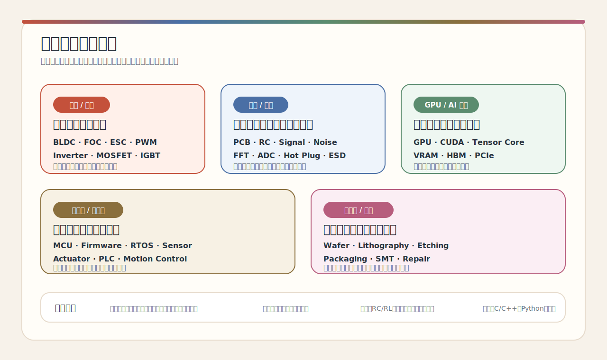

# 工程术语查漏补缺表

你在装机、维修、视频、项目、设备说明或日常使用里遇到一个词，往往不是只差一个翻译，而是它背后牵出一整块知识。

## 电机、电源与控制

| 英文词 | 中文 | 说人话 | 全称 | 德语 |
|---|---|---|---|---|
| BLDC | 无刷直流电机 | 没有电刷的电机，常见于无人机、电动车、风扇、机器人。 | Brushless DC Motor | bürstenloser Gleichstrommotor / BLDC-Motor |
| FOC | 磁场定向控制 / 矢量控制 | 一种更精细地控制电机转矩和速度的方法。 | Field-Oriented Control | feldorientierte Regelung / Vektorregelung |
| ESC | 电子调速器 | 给无刷电机“发指令”的小盒子，控制它转多快、怎么转。 | Electronic Speed Controller | elektronischer Drehzahlregler |
| PWM | 脉宽调制 | 用快速开关来控制平均电压或功率。 | Pulse Width Modulation | Pulsweitenmodulation |
| Inverter | 逆变器 | 把直流电变成交流电，电动车、电网、太阳能里都常见。 | Inverter | Wechselrichter |
| Converter | 变换器 | 把一种电压、电流或电能形式变成另一种。 | Converter | Wandler / Umrichter |
| Power Electronics | 电力电子 | 研究怎么高效、安全地转换和控制电能。 | Power Electronics | Leistungselektronik |
| MOSFET | 金属氧化物半导体场效应晶体管 | 电路里的高速开关，电源、电机驱动、主板供电里很常见。 | Metal-Oxide-Semiconductor Field-Effect Transistor | MOSFET / Feldeffekttransistor |
| IGBT | 绝缘栅双极晶体管 | 大功率电力电子里的开关器件，常见于逆变器和工业驱动。 | Insulated-Gate Bipolar Transistor | IGBT |

## 电路与信号

| 英文词 | 中文 | 说人话 | 全称 | 德语 |
|---|---|---|---|---|
| RC Circuit | RC 电路 / 阻容电路 | 电阻加电容，常用来延时、滤波、平滑信号。 | Resistor-Capacitor Circuit | RC-Schaltung |
| RL Circuit | RL 电路 / 阻感电路 | 电阻加电感，常用来理解线圈、电机、电流变化。 | Resistor-Inductor Circuit | RL-Schaltung |
| RLC Circuit | RLC 电路 | 电阻、电感、电容组合，和振荡、滤波、共振有关。 | Resistor-Inductor-Capacitor Circuit | RLC-Schaltung |
| PCB | 印刷电路板 | 电子元器件焊在上面的板子。 | Printed Circuit Board | Leiterplatte / Platine |
| Schematic | 原理图 | 电路的“地图”，告诉你元器件怎么连接。 | Schematic Diagram | Schaltplan |
| Signal | 信号 | 传递信息的电压、电流、波形或数据。 | Signal | Signal |
| Noise | 噪声 | 不想要的干扰，会让测量和通信变脏。 | Noise | Rauschen / Störung |
| Filter | 滤波器 | 保留想要的频率，压掉不想要的频率。 | Filter | Filter |
| Fourier Transform | 傅里叶变换 | 把复杂波形拆成不同频率，方便看噪声、振动、滤波。 | Fourier Transform | Fourier-Transformation |
| FFT | 快速傅里叶变换 | 电脑快速算傅里叶的方法。 | Fast Fourier Transform | schnelle Fourier-Transformation / FFT |
| ADC | 模数转换器 | 把真实世界的模拟信号变成数字数据。 | Analog-to-Digital Converter | Analog-Digital-Wandler |
| DAC | 数模转换器 | 把数字数据变成电压、电流或声音这类模拟输出。 | Digital-to-Analog Converter | Digital-Analog-Wandler |
| Hot Plug | 热插入 | 系统运行时插入设备；不是所有接口都能这样做。 | Hot Plug | Hot-Plug |
| Hot Swap | 热更换 | 系统运行时拔下旧设备、换上新设备，服务器和工业设备里更常见。 | Hot Swap | Hot-Swap |
| Inrush Current | 浪涌电流 | 刚接上电时，电容充电造成的瞬间大电流。 | Inrush Current | Einschaltstrom |
| ESD | 静电放电 | 静电瞬间释放，可能打坏芯片或接口。 | Electrostatic Discharge | elektrostatische Entladung / ESD |

## GPU、AI 硬件与计算

| 英文词 | 中文 | 说人话 | 全称 | 德语 |
|---|---|---|---|---|
| GPU | 图形处理器 / 显卡核心 | 很擅长并行计算的芯片，现在不只画图，也跑 AI。 | Graphics Processing Unit | Grafikprozessor |
| CPU | 中央处理器 | 电脑的通用“大脑”，负责复杂控制和通用计算。 | Central Processing Unit | Hauptprozessor / Zentralprozessor |
| CUDA | CUDA 并行计算平台 | NVIDIA GPU 的编程生态，让程序能用 GPU 干活。 | Compute Unified Device Architecture | CUDA |
| Tensor Core | 张量核心 | NVIDIA GPU 里专门加速 AI 矩阵计算的单元。 | Tensor Core | Tensor-Kern |
| VRAM | 显存 | 显卡自己的高速内存，AI 模型和图形数据会放在这里。 | Video RAM | Grafikspeicher |
| HBM | 高带宽内存 | 带宽很高的内存，常见于高端 AI 加速器。 | High Bandwidth Memory | High Bandwidth Memory / HBM |
| Accelerator | 硬件加速器 | 专门为某类任务加速的硬件，比如 AI、视频编码、加密。 | Hardware Accelerator | Hardwarebeschleuniger |
| Edge AI | 边缘 AI | 在本地设备上跑 AI，不一定把数据传到云端。 | Edge Artificial Intelligence | Edge-KI |
| PCIe | PCI Express / PCIe 总线 | 显卡、网卡、SSD 常用的高速总线。 | Peripheral Component Interconnect Express | PCI Express |
| Link Training | 链路训练 | PCIe 两端协商速度、通道数和信号参数的过程。 | Link Training | Link Training |
| Enumeration | 设备枚举 | 系统发现设备、分配资源、加载驱动的过程。 | Enumeration | Geräteerkennung / Enumeration |

## 嵌入式、机器人与自动化

| 英文词 | 中文 | 说人话 | 全称 | 德语 |
|---|---|---|---|---|
| MCU | 微控制器 | 小型芯片，负责读传感器、控制电机、跑简单程序。 | Microcontroller Unit | Mikrocontroller |
| SoC | 片上系统 | 把 CPU、GPU、接口等很多模块放进一颗芯片。 | System on Chip | System-on-Chip |
| Firmware | 固件 | 跑在硬件里的底层软件。 | Firmware | Firmware |
| RTOS | 实时操作系统 | 对时间要求很严格的小型操作系统。 | Real-Time Operating System | Echtzeitbetriebssystem |
| Sensor | 传感器 | 把温度、位置、速度、光、压力等真实世界信息变成信号。 | Sensor | Sensor |
| Actuator | 执行器 | 让系统真的动起来的东西，比如电机、阀门、机械臂关节。 | Actuator | Aktor / Stellglied |
| PLC | 可编程逻辑控制器 | 工厂里控制设备和产线的工业电脑。 | Programmable Logic Controller | SPS / Speicherprogrammierbare Steuerung |
| HMI | 人机界面 | 工人和机器交互的屏幕或界面。 | Human-Machine Interface | Mensch-Maschine-Schnittstelle / HMI |
| SCADA | 监控与数据采集系统 | 用来监控工厂、电网、水处理等大型系统。 | Supervisory Control and Data Acquisition | SCADA |
| Robot Arm | 机械臂 | 工厂里常见的多关节机器人。 | Robot Arm | Roboterarm |
| Motion Control | 运动控制 | 控制位置、速度、加速度，让机器动得准。 | Motion Control | Bewegungssteuerung |

## 半导体、制造与维修

| 英文词 | 中文 | 说人话 | 全称 | 德语 |
|---|---|---|---|---|
| Semiconductor | 半导体 | 介于导体和绝缘体之间的材料，也是芯片工业的基础。 | Semiconductor | Halbleiter |
| Wafer | 晶圆 | 做芯片的圆形硅片。 | Wafer | Wafer |
| Lithography | 光刻 | 把极小的电路图案“印”到晶圆上的关键工艺。 | Lithography | Lithografie |
| Etching | 刻蚀 | 把不需要的材料去掉，留下想要的结构。 | Etching | Ätzen |
| Deposition | 沉积 | 在晶圆上长出或覆盖一层材料。 | Deposition | Abscheidung |
| Packaging | 封装 | 把芯片保护起来，并接到外部电路。 | Packaging | Packaging / Gehäusetechnik |
| SMT | 表面贴装技术 | 把元器件贴装到 PCB 上的制造工艺。 | Surface-Mount Technology | Oberflächenmontage / SMT |
| Reflow Soldering | 回流焊 | 用加热把焊锡熔化，让元件焊到电路板上。 | Reflow Soldering | Reflow-Löten |
| Teardown | 拆解 | 把产品拆开，看里面怎么设计。 | Teardown | Zerlegung / Teardown |
| Repair | 维修 | 找故障、换元件、恢复设备功能。 | Repair | Reparatur |
| Debugging | 调试 | 找出系统为什么不工作，并一步步修正。 | Debugging | Fehlersuche / Debugging |
